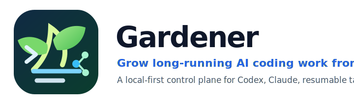

<p align="center">
  
</p>

<p align="center">
  <strong>Run AI coding agents as reliable, resumable local jobs — with a web UI your users can actually understand.</strong>
</p>

<p align="center">
  <a href="https://github.com/iwzy7071/auto_gardener/actions/workflows/ci.yml"></a>
  <a href="LICENSE"></a>
  
  
</p>

# Gardener

Gardener is a **local-first control plane for AI coding agents**. It wraps CLIs such as Codex and Claude Code with a browser UI, task state, progress visibility, resumable execution, local file safety boundaries, packaging scripts, and optional remote relay access.

Developers get the part that raw agent CLIs usually do not provide: **a durable job system around long-running AI work**. Users can start a task, watch progress, resume when a model or CLI stalls, and find outputs without learning terminal workflows.

## Why developers care

- **Turn agent CLIs into a product surface**: Codex / Claude become a web app with task history, progress, files, and settings.
- **Keep execution local**: source code and generated files stay on the user's machine by default; no database is required.
- **Make long tasks survivable**: Forest / Tree state, resumable jobs, visible progress, and failure cues reduce silent-stop confusion.
- **Ship to non-technical users**: Windows and macOS packaging scripts provide one-click-ish startup and upgrade flows.
- **Support remote access without centralizing code**: optional relay/frp deployment lets a phone or another network reach the local Gardener instance.

## Core concept

```text
User goal
  └─ Forest: one durable task session
       ├─ Tree: parallel or staged agent worker
       ├─ Fruit: final user-readable output
       └─ Workspace: the local directory where code/files are changed
```

Gardener does not try to replace coding agents. It adds the missing orchestration layer around them: task planning, execution state, UI, persistence, file viewing, continuation, and deployment packaging.

## Features

- Web UI for creating and monitoring AI coding tasks.
- Local file-based storage; no external database.
- Per-task workspace selection.
- Codex CLI and Claude Code integration points.
- Goal/continuation-oriented task execution model.
- Progress, output, file preview, and task detail URLs.
- Windows-first packaging, macOS packaging, and upgrade scripts.
- Optional multi-user relay deployment for remote access.
- DingTalk robot integration for mobile/remote control.
- Public-release safety rules to keep private deployment data out of git.

## Quick start for developers

Requirements:

- Go 1.20+
- Node.js, for checking frontend JavaScript
- Codex CLI and/or Claude Code if you want to run real agent tasks

Run locally:

```bash
git clone git@github.com:iwzy7071/auto_gardener.git
cd auto_gardener
go run ./cmd/server
```

Open:

```text
http://localhost:8080
```

Run the full local check:

```bash
make check
```

## Windows user package

For non-technical Windows users, distribute the generated package instead of a single exe:

```text
Gardener-Windows.zip
```

Build it from macOS/Linux:

```bash
./scripts/build-windows-package.sh
```

The package includes startup and update scripts under `packaging/windows/`.

## Configuration

Gardener is configured with local environment variables and ignored local files. Do not commit real deployment values.

Common variables:

| Variable | Purpose |
| --- | --- |
| `AUTO_GARDENER_DATA` | Override local task data directory. |
| `AUTO_GARDENER_STATIC` | Override static web assets directory. |
| `AUTO_GARDENER_CODEX_CMD` | Path to Codex CLI. |
| `AUTO_GARDENER_CLAUDE_CMD` | Path to Claude Code CLI. |
| `AUTO_GARDENER_DINGTALK_WEBHOOK` | Optional DingTalk reply webhook. |

Relay deployment examples start from:

```bash
cp config/gardener-relay.env.example config/gardener-relay.env.local
```

Then edit the `.local` file. It is intentionally ignored by git.

## Repository map

```text
cmd/server/                 Go server entrypoint
internal/app/               Gardener orchestration, HTTP API, storage, power checks
internal/codex/             CLI runner integration
internal/compat/            OS compatibility helpers
web/static/                 Browser UI
packaging/windows/          Windows install/start/update scripts
packaging/macos/            macOS install/start/update scripts
deploy/gardener-relay.py    Multi-user relay helper
scripts/                    Package build scripts
docs/REFERENCE.md           Detailed usage and historical configuration notes
```

## Documentation

- [Detailed reference](docs/REFERENCE.md)
- [Multi-instance relay guide](DEPLOY_MULTI_INSTANCE_RELAY.md)
- [Public release safety checklist](SECURITY_PUBLIC_RELEASE.md)
- [Contributing guide](CONTRIBUTING.md)
- [Security policy](SECURITY.md)
- [Changelog](CHANGELOG.md)

## Safety model

Gardener can run powerful local CLI agents that execute commands and modify files. Treat it like a local developer tool, not a sandbox.

Recommended practices:

- Use an explicit workspace for every task.
- Keep secrets out of task prompts and logs.
- Review agent changes before committing.
- Do not publish relay passwords, setup keys, frp tokens, htpasswd files, packaged binaries, or runtime task data.
- Read [`SECURITY_PUBLIC_RELEASE.md`](SECURITY_PUBLIC_RELEASE.md) before pushing public changes.

## Development

```bash
make test          # go test ./...
make vet           # go vet ./...
make js-check      # node --check web/static/app.js
make windows-build # cross-compile Windows server
make check         # all core checks
```

## License

Gardener is released under the [MIT License](LICENSE).
