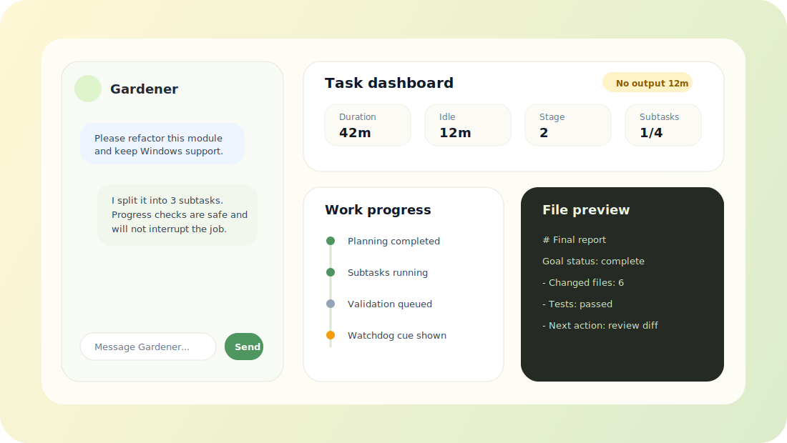

<p align="center">
  
</p>

<p align="center">
  <strong>Run AI coding agents as reliable, resumable local jobs — with a web UI your users can actually understand.</strong><br>
  <strong>把 AI 编程 Agent 变成可靠、可恢复、可远程访问的本地任务系统。</strong>
</p>

<p align="center">
  <a href="https://github.com/iwzy7071/auto_gardener/actions/workflows/ci.yml"></a>
  <a href="LICENSE"></a>
  
  
</p>

<p align="center">
  <a href="#english">English</a> · <a href="#中文">中文</a>
</p>

# Gardener

<a id="english"></a>

## English

Gardener is a **local-first control plane for AI coding agents**. It wraps CLIs such as Codex and Claude Code with a browser UI, task state, progress visibility, resumable execution, local file safety boundaries, packaging scripts, and optional remote relay access.

Raw agent CLIs are powerful, but they are not a complete product experience. Gardener adds the durable job layer around them: users can start a task, watch progress, resume when a model or CLI stalls, and find outputs without learning terminal workflows.

### Product preview

<p align="center">
  
</p>

### Why developers care

- **Turn agent CLIs into a product surface**: Codex / Claude become a web app with task history, progress, files, and settings.
- **Keep execution local**: source code and generated files stay on the user's machine by default; no database is required.
- **Make long tasks survivable**: Forest / Tree state, resumable jobs, visible progress, and failure cues reduce silent-stop confusion.
- **Ship to non-technical users**: Windows and macOS packaging scripts provide one-click-ish startup and upgrade flows.
- **Support remote access without centralizing code**: optional relay/frp deployment lets a phone or another network reach the local Gardener instance.

### Core concept

```text
User goal
  └─ Forest: one durable task session
       ├─ Tree: parallel or staged agent worker
       ├─ Fruit: final user-readable output
       └─ Workspace: the local directory where code/files are changed
```

Gardener does not try to replace coding agents. It adds the missing orchestration layer around them: planning, execution state, UI, persistence, file viewing, continuation, and deployment packaging.

### Features

- Web UI for creating and monitoring AI coding tasks.
- Local file-based storage; no external database.
- Per-task workspace selection.
- Codex CLI and Claude Code integration points.
- Goal/continuation-oriented task execution model.
- Task dashboard with runtime diagnostics, idle-time cues, and safe progress queries.
- Watchdog hints for long-running tasks that stop producing output.
- Progress, output, file preview, and task detail URLs.
- Windows-first packaging, macOS packaging, and upgrade scripts.
- Optional multi-user relay deployment for remote access.
- DingTalk robot integration for mobile/remote control.
- Public-release safety rules to keep private deployment data out of git.

### Quick start

Requirements:

- Go 1.20+
- Node.js, for checking frontend JavaScript
- Codex CLI and/or Claude Code if you want to run real agent tasks

Run locally:

```bash
git clone git@github.com:iwzy7071/auto_gardener.git
cd auto_gardener
go run ./cmd/server
```

Open:

```text
http://localhost:8080
```

Run the full local check:

```bash
make check
```

Run without real Codex / Claude CLIs for smoke testing:

```bash
AUTO_GARDENER_RUNNER=mock go run ./cmd/server
```

### Windows user package

For non-technical Windows users, distribute the generated package instead of a single exe:

```text
Gardener-Windows.zip
```

Build it from macOS/Linux:

```bash
./scripts/build-windows-package.sh
```

The package includes startup and update scripts under `packaging/windows/`.

### Configuration

Gardener is configured with local environment variables and ignored local files. Do not commit real deployment values.

Common variables:

| Variable | Purpose |
| --- | --- |
| `AUTO_GARDENER_DATA` | Override local task data directory. |
| `AUTO_GARDENER_STATIC` | Override static web assets directory. |
| `AUTO_GARDENER_CODEX_CMD` | Path to Codex CLI. |
| `AUTO_GARDENER_CLAUDE_CMD` | Path to Claude Code CLI. |
| `AUTO_GARDENER_DINGTALK_WEBHOOK` | Optional DingTalk reply webhook. |

Relay deployment examples start from:

```bash
cp config/gardener-relay.env.example config/gardener-relay.env.local
```

Then edit the `.local` file. It is intentionally ignored by git.

### Repository map

```text
cmd/server/                 Go server entrypoint
internal/app/               Gardener orchestration, HTTP API, storage, power checks
internal/codex/             CLI runner integration
internal/compat/            OS compatibility helpers
web/static/                 Browser UI
packaging/windows/          Windows install/start/update scripts
packaging/macos/            macOS install/start/update scripts
deploy/gardener-relay.py    Multi-user relay helper
scripts/                    Package build scripts
docs/REFERENCE.md           Detailed usage and historical configuration notes
```

### Documentation

- [Detailed reference](docs/REFERENCE.md)
- [Multi-instance relay guide](DEPLOY_MULTI_INSTANCE_RELAY.md)
- [Public release safety checklist](SECURITY_PUBLIC_RELEASE.md)
- [Contributing guide](CONTRIBUTING.md)
- [Security policy](SECURITY.md)
- [Changelog](CHANGELOG.md)

### Safety model

Gardener can run powerful local CLI agents that execute commands and modify files. Treat it like a local developer tool, not a sandbox.

Recommended practices:

- Use an explicit workspace for every task.
- Keep secrets out of task prompts and logs.
- Review agent changes before committing.
- Do not publish relay passwords, setup keys, frp tokens, htpasswd files, packaged binaries, or runtime task data.
- Read [`SECURITY_PUBLIC_RELEASE.md`](SECURITY_PUBLIC_RELEASE.md) before pushing public changes.

### Development

```bash
make test          # go test ./...
make vet           # go vet ./...
make js-check      # node --check web/static/app.js
make windows-build # cross-compile Windows server
make check         # all core checks
```

<a id="中文"></a>

## 中文

Gardener 是一个**本地优先的 AI 编程 Agent 控制平面**。它把 Codex、Claude Code 等 CLI 包装成带浏览器界面、任务状态、进度反馈、可恢复执行、本地文件边界、安装打包脚本和可选公网中转能力的本地任务系统。

原始 Agent CLI 很强，但它们通常不是完整的产品体验。Gardener 补上的正是这层“长期任务系统”：用户可以发起任务、查看进度、在模型或 CLI 卡住后继续任务，并在 Web UI 中找到结果，而不需要理解终端工作流。

### 产品预览

<p align="center">
  
</p>

### 为什么开发者会关心

- **把 Agent CLI 变成产品界面**：Codex / Claude 不再只是命令行，而是拥有任务历史、进度、文件和设置的 Web 应用。
- **保持本地执行**：源码和生成文件默认留在用户电脑上，不依赖外部数据库。
- **让长任务可恢复**：Forest / Tree 状态、继续任务、进度提示和失败 cue 可以减少“任务默默停止”的困惑。
- **能交付给小白用户**：Windows 和 macOS 打包脚本支持接近一键启动和升级。
- **支持远程访问但不集中托管代码**：可选 relay/frp 方案让手机或异地网络访问本机 Gardener 实例。

### 核心概念

```text
用户目标
  └─ Forest：一个可持久化的任务会话
       ├─ Tree：并行或分阶段执行的 Agent worker
       ├─ Fruit：面向用户的最终结果
       └─ Workspace：实际修改代码/文件的本地目录
```

Gardener 不是要替代编程 Agent，而是在它们外面补一层缺失的编排能力：规划、执行状态、UI、持久化、文件查看、继续任务和安装部署。

### 主要能力

- 通过 Web UI 创建和监控 AI 编程任务。
- 本地文件存储，不需要外部数据库。
- 每个任务可以选择独立 workspace。
- 接入 Codex CLI 和 Claude Code。
- 面向 goal / continuation 的任务执行模型。
- 任务驾驶舱支持运行诊断、无输出提示和安全进度查询。
- Watchdog 会在长任务长期无输出时主动提示用户。
- 支持进度、输出、文件预览和任务详情 URL。
- Windows 优先的安装包，兼顾 macOS 打包和升级脚本。
- 可选多用户公网中转部署。
- 支持钉钉机器人，用于手机端/远程控制。
- 提供 public 仓库安全规则，避免提交私有部署信息。

### 快速开始

依赖：

- Go 1.20+
- Node.js，用于检查前端 JavaScript
- 如果要运行真实 Agent 任务，需要安装 Codex CLI 和/或 Claude Code

本地运行：

```bash
git clone git@github.com:iwzy7071/auto_gardener.git
cd auto_gardener
go run ./cmd/server
```

打开：

```text
http://localhost:8080
```

运行完整检查：

```bash
make check
```

不依赖真实 Codex / Claude CLI 的 smoke test 运行方式：

```bash
AUTO_GARDENER_RUNNER=mock go run ./cmd/server
```

### Windows 用户安装包

给非技术 Windows 用户分发时，建议分发完整压缩包，而不是单独 exe：

```text
Gardener-Windows.zip
```

在 macOS/Linux 上构建：

```bash
./scripts/build-windows-package.sh
```

启动和升级脚本位于：

```text
packaging/windows/
```

### 配置方式

Gardener 使用本地环境变量和被 git 忽略的本地配置文件。不要提交真实部署值。

常见变量：

| 变量 | 用途 |
| --- | --- |
| `AUTO_GARDENER_DATA` | 覆盖本地任务数据目录。 |
| `AUTO_GARDENER_STATIC` | 覆盖静态前端资源目录。 |
| `AUTO_GARDENER_CODEX_CMD` | Codex CLI 路径。 |
| `AUTO_GARDENER_CLAUDE_CMD` | Claude Code CLI 路径。 |
| `AUTO_GARDENER_DINGTALK_WEBHOOK` | 可选钉钉回复 webhook。 |

公网中转部署示例从这里开始：

```bash
cp config/gardener-relay.env.example config/gardener-relay.env.local
```

然后编辑 `.local` 文件。该文件会被 git 忽略。

### 仓库结构

```text
cmd/server/                 Go 服务入口
internal/app/               Gardener 编排、HTTP API、存储、电源检查
internal/codex/             CLI runner 接入
internal/compat/            操作系统兼容辅助代码
web/static/                 浏览器 UI
packaging/windows/          Windows 安装/启动/升级脚本
packaging/macos/            macOS 安装/启动/升级脚本
deploy/gardener-relay.py    多用户公网中转辅助工具
scripts/                    安装包构建脚本
docs/REFERENCE.md           更详细的使用和历史配置说明
```

### 文档

- [详细参考文档](docs/REFERENCE.md)
- [多实例公网中转指南](DEPLOY_MULTI_INSTANCE_RELAY.md)
- [Public release 安全检查清单](SECURITY_PUBLIC_RELEASE.md)
- [贡献指南](CONTRIBUTING.md)
- [安全策略](SECURITY.md)
- [更新日志](CHANGELOG.md)

### 安全模型

Gardener 会运行强权限的本地 CLI Agent，这些 Agent 可以执行命令并修改文件。请把它当作本地开发者工具，而不是沙箱。

建议：

- 每个任务使用明确的 workspace。
- 不要把密钥写入任务提示词或日志。
- 提交代码前先审查 Agent 产生的修改。
- 不要公开 relay 密码、setup key、frp token、htpasswd、安装包二进制或运行时任务数据。
- 推送 public 仓库前阅读 [`SECURITY_PUBLIC_RELEASE.md`](SECURITY_PUBLIC_RELEASE.md)。

### 开发

```bash
make test          # go test ./...
make vet           # go vet ./...
make js-check      # node --check web/static/app.js
make windows-build # 交叉编译 Windows 服务端
make check         # 全部核心检查
```

## License / 许可证

Gardener is released under the [MIT License](LICENSE).

Gardener 使用 [MIT License](LICENSE) 开源。
